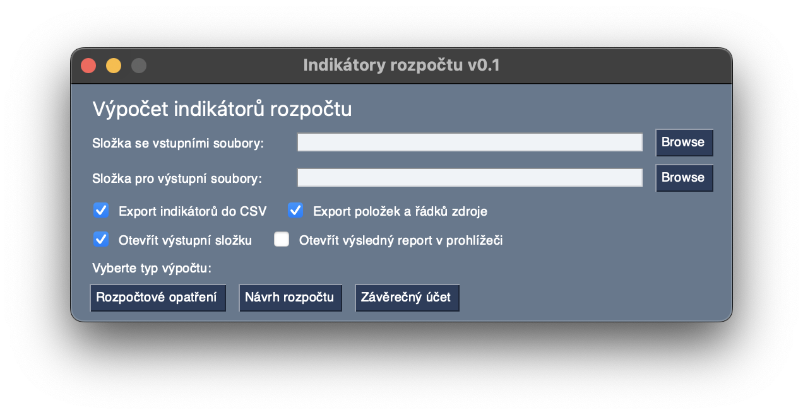
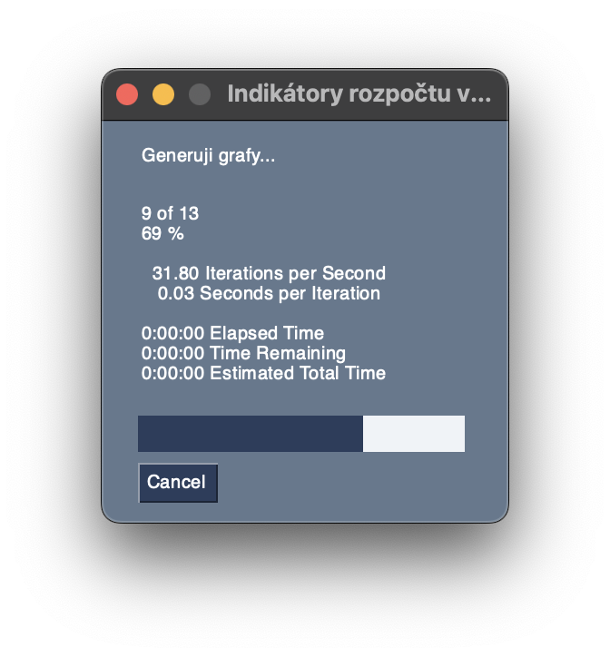
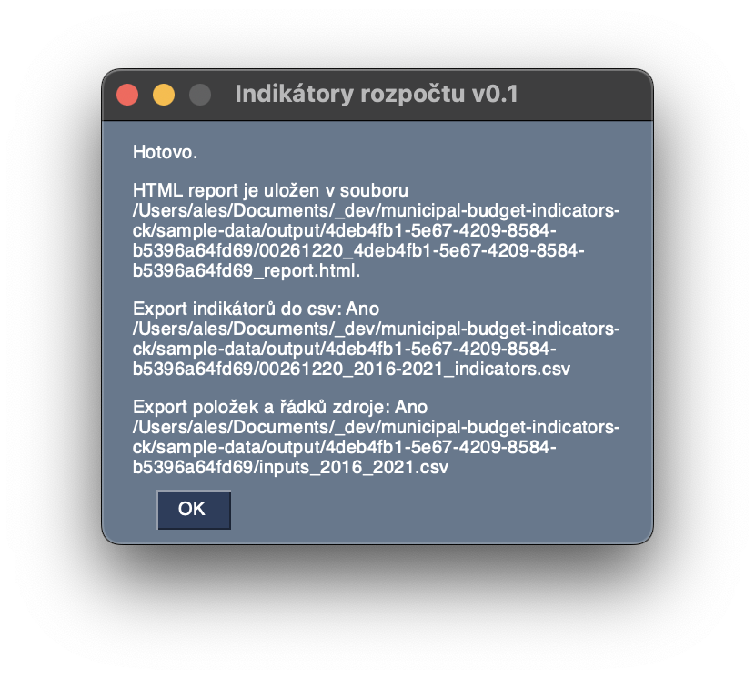
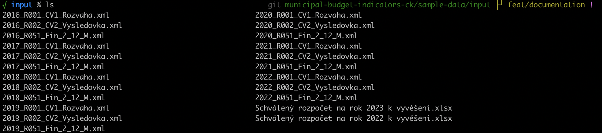
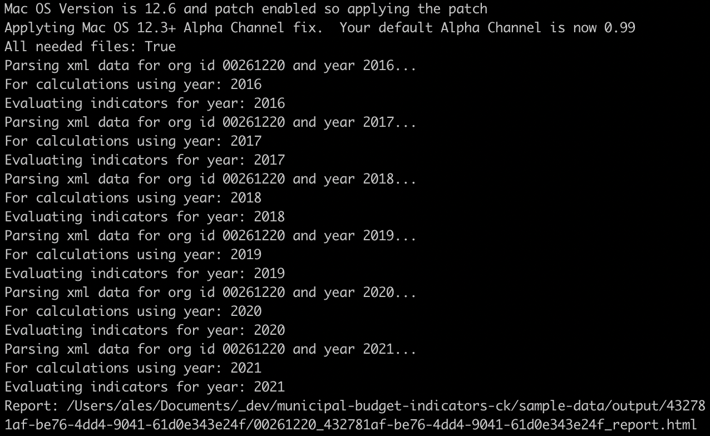
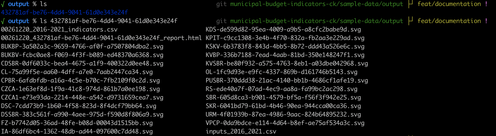

# municipal-budget-indicators-ck
Calculation of municipal budget indicators for evaluating the financial stability of the city and for proposing the budget of the city of Česká Kamenice.

The calculation is based on the document of the Financial Committee entitled "Draft of indicators for evaluating the financial stability of the city and for proposing the budget for the next period" (Návrh ukazatelů pro hodnocení finanční stability města a pro navrhování rozpočtu na další období) approved at the 25th meeting of the City Council on September 7, 2022.

Inputs for this tool is XML export from IS VERA of statements: Balance Sheet, Profit and Loss Statement and FIN 2-12 M - Budget Fulfillment of LGU. Last type of input is Excel file (XSLS) with Year Budget Proposal of LGU.

Windowed output of this tool is in czech language only, console output is in English.

## Prerequisites

### Operating system
If you want to use this tool in **developer way** like `python main.py`, you can use MacOS, Windows or Linux. Tool is tested on MacOS 12.6 and Windows 10 build 17074 (for better compatibility).

For **exe build** you need Windows 10 build 17074 (Jan 2018) or newer. No other requirements for this build is no needed.

For **MacOS .app build** you need MacOS. Package is bundled on x86_64 architecture, so on M1 or better architectures Rosetta2 is used.

### Framework infrastructure
For **developer way** use you need install [Python 3.10.2](https://www.python.org/downloads/) or newer. You also need [Pipenv](https://pypi.org/project/pipenv/) for installing required libraries to virtual environment.

For **exe build** there are no framework you need.

For **MacOS .app build** there are no framework you need.

### Knowledge
Basic Python knowledge is sufficient to edit and run this tool.
Knowledge of city budget statements is also welcomed, but it is described (with minor XML tags differences) on [Data Catalog page on Monitor - Complete overview of public finance](https://monitor.statnipokladna.cz/datovy-katalog/webova-sluzba) site.

## Getting started

Firstly, check requirements. You need [git 2.0](https://git-scm.com) or better, Python and pipenv to be installed.

Clone repository:
```
$ git clone https://github.com/adpro/municipal-budget-indicators-ck.git
```
Go to project repository and its source code:
```
$ cd municipal-budget-indicators-ck/municipal-budget-indicators-ck
```
Create pipenv virtual environment:
```
$ pipenv shell
```
Install all required packages from Pipenv.lock
```
$ pipenv sync
```
Download from IS VERA XML statements 001 (Balance Sheet), 002 (Profit and Loss Statement) and 051 (FIN 2-12 M - Budget Fulfillment of LGU) for last 6 full years and save them to folder, which will be used as input. Location is up to you.
Create output folder if you haven't got it. Location is up to you.

Run `main.py` script:
```
$ python main.py
```
App window appears. Select input and output folders (last ones are inserted):

Select options you like or skip this step to next one.
Select one of buttons. If you exported data according this tutorial, choose 'Závěrečný účet'.

Tool start working and window with progress bar is shown:


At the end last window is shown with files path in output folder:


In output folder you can find find folder with GUID name. Inside of it there are many SVG files with calculated charts, html file with report and if you check option in first window, CSV files with inputs and calculated indicators.

### Examples

First, export data from IS VERA to our input folder, eg.:



Running app:
```
(municipal-budget-indicators-ck) municipal-budget-indicators-ck $ python main.py
```
Select input and output folder

and select one of buttons for calculation, console output will be:


And progress bar in window is shown:


At the end, final window is shown with paths to exported files:


We can check our output folder:


## Contributing
Please read [CONTRIBUTING.md](./CONTRIBUTING.md) for details on code of conduct, and the process for submitting pull requests.


## License

municipal-budget-indicators-ck is licensed under the Apache 2.0 license - see the [LICENSE](./LICENSE) file
for details.

## Credits
adpro - author, chairman of the Finance Comittee 2018-2022, author of Draft
